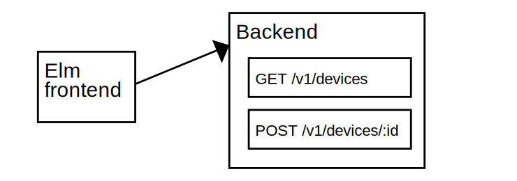

# Testing programs with Cmds

`elm-program-test` allows you to test and simulate responses to
`Cmd`s produced by your Elm program.
However, Elm does not currently provide a way to inspect `Cmd` values,
so you must define your own "effect" type to be able to test your program in this way.
The rest of this page walks through an example of how to do that.


## Introducing the example program

The rest of this section will be working with an example program
that interacts with a fictional API for controlling the lights in your house.

This diagram shows the architecture of the example application.
The Elm code makes HTTP requests to two different endpoints:
`/v1/devices` to get a list of all the lights that can be controlled,
and `/v1/devices/:id` to change the setting of a specific light.




## Goal: the ideal test

The test we want to write represents the following scenario:

1. The user loads the main page
1. The page requests the list of lights
1. The server responds with the list of lights and their current states
1. The user clicks "Turn on" for the kitchen lights
1. We expect the page to send a request to the server with the correct values

Here's what that test will look like in code:

```elm
import Expect
import Test exposing (test)
import TestContext

test "controlling a light" <|
    \() ->
        start
            |> TestContext.simulateHttpOk
                "GET"
                "http://localhost:8003/lighting_service/v1/devices"
                """[{"id":"K001", "name":"Kitchen", "dimmable":false, "value":0}]"""
            |> TestContext.clickButton "Turn on"
            |> TestContext.assertHttpRequest
                "POST"
                "http://localhost:8003/lighting_service/v1/devices/K001"
                (.body >> Expect.equal """{"value":1}""")
            |> TestContext.done
```

However, running this test produces the following failure:

```
↓ HomeAutomationExampleTest
✗ controlling a light

    TEST SETUP ERROR: In order to use simulateHttpResponse,
    you MUST use TestContext.withSimulatedEffects before calling TestContext.start


TEST RUN FAILED
```

As the error explains, we must use `TestContext.withSimulatedEffects`
before the test will work.
But in order to call `withSimulatedEffects`,
we have to provide a function of type `effect -> List TestContext.SimulatedEffect`.
But the effect type of our program
(the type that `init` and `update` return as the second item in the tuple)
is currently `Cmd Msg` -- which is a type that is not possible to inspect the values of.
So first we'll need to make a new type which can represent all the effects
our program can produce, then we can implement the required function,
and then we'll be able to inspect and simulate those effects in our tests. 
 


## Making it work


### Planning the change

The first thing we need to do is define an inspectable type
that can represent all the effects that our `update` and `init` functions
want to produce.
Our `init` and `update` functions will change to use this new type,
and we'll also need to define a function that can turn this new type
into `Cmd`s for when our program is compiled for production.

So in our existing main module:

```elm
init : Flags -> ( Model, Cmd Msg )
update : Msg -> Model -> ( Model, Cmd Msg )
```

will change to:

```elm
type Effect

init : Flags -> ( Model, Effect )
update : Msg -> Model -> ( Model, Effect )

perform : Effect -> Cmd Msg
```


### Defining an "Effect" type

Taking a look through the `init` and `update` functions,
the following `Cmd`s are being produced --
the new type we make will need to have a variant for each one:

- `Cmd.none`
- `loadDeviceList`, which itself uses `Http.get`
- `changeLight`, which itself uses `Http.post`

Each variant we create should contain just enough information to
call the functions necessary to create the corresponding `Cmd`.
Following that guideline, we'll end up with an `Effect` type like this
and the corresponding `perform` function:

```elm
type Effect
    = NoEffect
    | GetDeviceList
        { url : String
        , decoder : Json.Decode.Decoder (List Light)
        , onResult : Result Http.Error (List Light) -> Msg
        }
    | ChangeLight
        { url : String
        , body : Json.Encode.Value
        , decoder : Json.Decode.Decoder Light
        , onResult : Result Http.Error Light -> Msg
        }

perform : Effect -> Cmd Msg
perform effect =
    case effect of
        NoEffect ->
            Cmd.none

        GetDeviceList { url, onResult, decoder } ->
            Http.get
                { url = url
                , expect = Http.expectJson onResult decoder
                }

        ChangeLight { url, onResult, decoder, body } ->
            Http.post
                { url = url
                , body = Http.jsonBody body
                , expect = Http.expectJson onResult decoder
                }
```

After changing `update` and `init` to return the corresponding `Effect` instead of a `Cmd`,
the final change to make the program compile again is to update our `main`
to make use of the `perform` function:

```elm
main : Program Flags Model Msg
main =
    Browser.document
        { init =
            \flags ->
                init flags
                    |> Tuple.mapSecond perform
        , update =
            \msg model ->
                update msg model
                    |> Tuple.mapSecond perform
        , subscriptions = subscriptions
        , view = view
        }
```


### Simulating effects

Now that our `update` and `init` functions use an effect type that
we can inspect the values of, we can write a function for our test suite
that can convert our new `Effect` type into simulated effects that
`elm-program-test` can understand:

```elm
import SimulatedEffect.Cmd
import SimulatedEffect.Http

simulateEffects : Main.Effect -> TestContext.SimulatedEffect Main.Msg
simulateEffects effect =
    case effect of
        Main.NoEffect ->
            SimulatedEffect.Cmd.none

        Main.GetDeviceList { url, onResult, decoder } ->
            SimulatedEffect.Http.get
                { url = url
                , expect = SimulatedEffect.Http.expectJson onResult decoder
                }

        Main.ChangeLight { url, onResult, decoder, body } ->
            SimulatedEffect.Http.post
                { url = url
                , body = SimulatedEffect.Http.jsonBody body
                , expect = SimulatedEffect.Http.expectJson onResult decoder
                }
```

And now that we have a function of the required type,
we can use it to enable effect simulation in our tests:

```elm
start : TestContext Main.Msg Main.Model Main.Effect
start =
    TestContext.createDocument
        { init = Main.init
        , update = Main.update
        , view = Main.view
        }
        |> TestContext.withSimulatedEffects simulateEffects
        |> TestContext.start ()
```

Now that we've enabled effects simulation, [our original test](#goal-the-ideal-test)
will successfully run!

