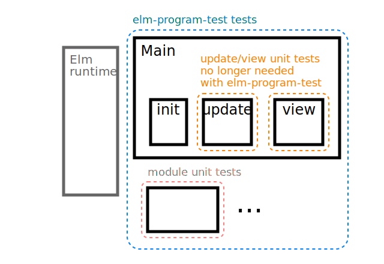

# Testing programs with interactive HTML

[`Test.Html` from the `elm-explorations/test` package](https://package.elm-lang.org/packages/elm-explorations/test/latest/Test-Html-Query)
make it possible to write unit tests for functions that return `Html msg`,
but often
(especially when your view is complicated enough to need to be tested)
good test coverage requires testing the interactions between your `view` and your `update` functions
(which communicate via the `Model` and `Msg`s, as explained in ["An Introduction to Elm: The Elm Architecture"](https://guide.elm-lang.org/architecture/)).

`elm-program-test` lets you write "high-level" tests for your program,
testing the public interface of your program rather than
testing `view` and `update` functions independently.
This gives you the flexibility to robustly test complex interactions
between your `view`, `update`, and the state of your program when necessary; 
and allows you to write your tests in terms of
how users and external services interact with your program.




## Introducing the example program

In this example, we'll be working with simple voter registration form.
Here's the page flow a user will experience:

<!-- TODO: turn into SVG -->
```
+----------------+                                +---------------+
|                |                                |               |
|                |                                |               |
|  Name:         |          +------------+        | Success!      |
|                |          |            |        |               |
|  Street        | submit   |            |        |               |
|  Address:      |--------->| Loading... |------->| Next election |
|                |          |            |        | date is ...   |
|  Postal code:  |          |            |        |               |
|                |          +------------+        |               |
|                |                                |               |
|                |                                |               |
+----------------+                                +---------------+
```

We'll be using elm-program-test to help us add field validation for the
"Postal code" field.

Using the `elm-program-test` will
help us build our UI in a way that makes it follow
some accessibility best practices.  


## Writing a program test

Our goal will be to write a test for the following scenario:

- The user fills in the form with:
    - their name
    - their street address
    - an **invalid postal code**
- The user tries to submit the form
- The app should show a validation error 


### Preparing to write a program test

Before we can write our actual test, we need to define how to create tests for our program.
This is similar to writing your `main` definition for using your app in production.
It's typical to call this definition `start` in your test file, but it can be called anything.

Here's the `start` definition for our example program:

```elm
module VoteRegratistrationExampleTest exposing (..)

import ProgramTest exposing (ProgramTest)
import VoterRegistrationExample as Main

start : ProgramTest Main.Model Main.Msg (Cmd Main.Msg)
start =
    ProgramTest.createDocument
        { init = Main.init
        , update = Main.update
        , view = Main.view
        }
        |> ProgramTest.start ()
```

Just like when using one of the `Browser` module functions to create your real program,
here we use one of the `ProgramText.create*` functions to create our program test.
We provide the `init`, `update`, and `view` functions that comprise our program.
After creating the program test definition, we use `ProgramTest.start` to pass the initial
flags to the program.


### Writing our test

Now that we've defined how to start our program, we can write our test:


```elm
module VoterRegistrationExampleTest exposing (all)

import ProgramTest exposing (ProgramTest, clickButton, expectViewHas, fillIn, update)
import Test exposing (..)
import Test.Html.Selector exposing (text)
import VoterRegistrationExample as Main

all : Test
all =
    describe "voter registration frontend"
        [ test "invalid postal code shows a validation error" <|
            \() ->
                start
                    |> fillIn "name" "Name" "Bailey Sheppard"
                    |> fillIn "street-address" "Street Address" "14 North Moore Street"
                    |> fillIn "postcode" "Postal Code" "0000" -- (only 4 digits)
                    |> clickButton "Register"
                    |> expectViewHas
                        [ text "You must enter a valid postal code"
                        ]
        ]
```

Here we use `start` (which we defined in the previous section) to initialize the program,
then simulate some user input using `fillIn` and `clickButton`,
and finally we assert something about the final state of the page.

Running the test gives us the following error:

```
↓ VoterRegistrationExampleTest
↓ voter registration frontend
✗ invalid postal code shows a validation error

    expectViewHas:
    ▼ Query.fromHtml
    
        <body>
            Loading...
        </body>

    
    ▼ Query.has [ text "You must enter a valid postal code" ]
    
    ✗ has text "You must enter a valid postal code"


TEST RUN FAILED
```


### Implementing the change

This section doesn't explain anything specific to elm-program-test, but for completeness
here are the changes needed to make the test pass:

```diff
--- a/src/VoterRegistrationExample.elm
+++ b/src/VoterRegistrationExample.elm
 type Model
     = Form
         { name : String
         , streetAddress : String
         , postalCode : String
+        , error : Maybe String
         }
     | ...
 
 
 init : Flags -> ( Model, Cmd Msg )
 init () =
     ( Form
         { name = ""
         , streetAddress = ""
         , postalCode = ""
+        , error = Nothing
         }
     , Cmd.none
     )


 update msg model =
     case ( model, msg) of
         ...
 
         ( Form info, SubmitRegistration ) ->
+            let
+                isValid =
+                    String.length info.postalCode == 5
+            in
+            if isValid then
                 ( Loading
                 , Http.post
                     { url = "/register"
                     , body =
                         Http.jsonBody <|
                             Json.Encode.object
                                 [ ( "name", Json.Encode.string info.name )
                                 , ( "streetAddress", Json.Encode.string info.streetAddress )
                                 , ( "postalCode", Json.Encode.string info.postalCode )
                                 ]
                     , expect =
                         Http.expectJson
                             RegistrationResponse
                             (Json.Decode.field "nextElection" Json.Decode.string)
                     }
                 )
+
+            else
+                ( Form { info | error = Just "You must enter a valid postal code" }
+                , Cmd.none
+                )
 
         ...


view : Model -> Browser.Document Msg
     ...
+                    , case info.error of
+                        Nothing ->
+                            Html.text ""
+
+                        Just error ->
+                            Html.text error
                     , Html.button
                         [ onClick SubmitRegistration ]
                         [ Html.text "Register" ]
     ...
``` 


## Try it out

You can play around with the example here:
<https://ellie-app.com/6wsc2LK2D97a1>
Try editing the tests or the implementation to make the tests fail
and see what kind of failure messages you get.
