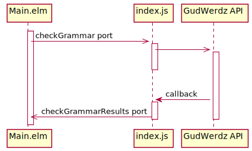

# Testing programs with ports

This guide **requires that you're already familiar with
[testing programs that use Cmds](cmds.md)**.
Specifically, you should understand how to set up your program for testing
by creating a custom Effect type and implementing a `simulateEffects` function.
If you aren't yet familiar with doing that, you should follow the
["testing programs that use Cmds" guide](cmds.md) first and return to this guide afterwards.


## Introducing the example program

The rest of this section will be working with an example program
that interacts with the fictional "GudWerdz" service for
checking the grammar and writing style of a text input.

The fictional "GudWerdz" service only provides a JavaScript SDK,
so our app needs to interact with it using [ports](https://guide.elm-lang.org/interop/ports.html).




## Goal: the ideal test

The test we want to write represents the following scenario:

1. The user fills in the text area with some text.
1. The user clicks the "Check" button.
1. The app sends the text to check out through the `checkGrammar` port, which will call the GudWerdz API.
1. The GudWerdz API returns a list of problems with the text, which get sent to the `checkGrammarResults` port.
1. The app receives the results and displays them to the user.

Here's what that test will look like in code:

```elm{14-22}
import Expect
import Json.Decode
import Json.Encode
import ProgramTest
import Test exposing (test)

test "checking grammar" <|
    \() ->
        start
            |> ProgramTest.fillIn "main"
                "Enter text to check"
                "The youngest man the boat."
            |> ProgramTest.clickButton "Check"
            |> ProgramTest.ensureOutgoingPortValues
                "checkGrammar"
                Json.Decode.string
                (Expect.equal [ "The youngest man the boat." ])
            |> ProgramTest.simulateIncomingPort
                "grammarCheckResults"
                (Json.Encode.list Json.Encode.string
                    [ "Garden-path sentences can confuse the reader." ]
                )
            |> ProgramTest.expectViewHas
                [ text "Garden-path sentences can confuse the reader." ]
```

After entering some text and clicking the "Check" button,
the test uses `ensureOutgoingPortValues` to assert that the entered text has been sent out on the "checkGrammar" port.
Then `simulateIncomingPort` is used to simulate a response coming in on the "grammarCheckResults" port.

However, before this test can pass we'll have to do some setup work
so that the test can simulate the incoming and outgoing ports.


## Simulating outgoing ports

We'll assume that we already have our test set up with `ProgramTest.withSimulatedEffects`
(if you're not familiar with that,
you should first follow the ["testing programs that use Cmds" guide](cmds.md)).

To add simulation of our port effect, we'll make use of `SimulatedEffect.Ports.send`
in our `simulateEffects` function:

```elm
import Json.Encode
import SimulatedEffect.Ports

simulateEffects : Main.Effect -> ProgramTest.SimulatedEffect Main.Msg
simulateEffects effect =
    case effect of
        ...
        Main.CheckGrammarEffect text ->
            SimulatedEffect.Ports.send "checkGrammar" (Json.Encode.string text)
```


## Simulating incoming ports

Similar to how we provided a `simulateEffects` function for testing our Cmds,
we'll need to provide a `simulateSubscriptions` function for testing our Subs.
This will parallel the `subscriptions` function in our main program,
but will return `ProgramTest.SimulatedSub` instead of the normal `Sub`.
(This is necessary because, as with `Cmd`s,
Elm currently provides no way to inspect the value of a `Sub`.)

For reference, here's our program's `subscriptions` function:

```elm
port grammarCheckResults : (List String -> msg) -> Sub msg

subscriptions : Model -> Sub Msg
subscriptions _ =
    grammarCheckResults GrammarCheckResults
```

And here's the corresponding `simulateSubscriptions` function we'll write for our test setup:

```elm
simulateSubscriptions : Main.Model -> ProgramTest.SimulatedSub Main.Msg
simulateSubscriptions _ =
    SimulatedEffect.Ports.subscribe "grammarCheckResults"
        (Json.Decode.list Json.Decode.string)
        Main.GrammarCheckResults
```

Finally, we configure our `ProgramTest` with the `simulateSubscriptions` function before starting it:

```elm{9}
start : ProgramTest Main.Msg Main.Model Main.Effect
start =
    ProgramTest.createDocument
        { init = Main.init
        , update = Main.update
        , view = Main.view
        }
        |> ProgramTest.withSimulatedEffects simulateEffects
        |> ProgramTest.withSimulatedSubscriptions simulateSub
        |> ProgramTest.start ()
```


## Try it out

> TODO: once `elm-program-test` 3.0.0 is published,
> a link to a live-editable version of this example will be added here
